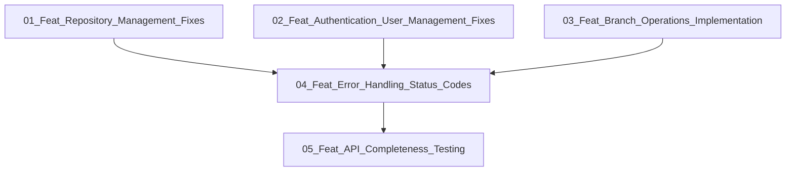

# Epic: CIDX Server Critical Issues Resolution

## Executive Summary
This epic addresses critical functionality failures discovered during the CIDX Server manual testing campaign. The issues include broken repository deletion, authentication failures, missing API endpoints, and non-functional branch operations that prevent the server from providing core functionality to users.

## Business Value
- **User Impact**: Resolves critical blockers preventing users from managing repositories, branches, and authentication
- **System Reliability**: Fixes HTTP 500 errors and broken pipe issues affecting system stability
- **API Completeness**: Implements missing endpoints required for full server functionality
- **Quality Assurance**: Ensures all core operations work reliably with proper error handling

## Overall Architecture

### System Components
```
┌─────────────────────────────────────────────────────────────┐
│                     CIDX Server API Layer                   │
├─────────────────────────────────────────────────────────────┤
│  ┌──────────────┐  ┌──────────────┐  ┌──────────────┐     │
│  │ Repository   │  │    Auth      │  │   Branch     │     │
│  │ Management   │  │  Management  │  │ Operations   │     │
│  └──────────────┘  └──────────────┘  └──────────────┘     │
├─────────────────────────────────────────────────────────────┤
│                    Service Layer                            │
│  ┌──────────────┐  ┌──────────────┐  ┌──────────────┐     │
│  │   Repository │  │     User     │  │    Git       │     │
│  │   Service    │  │   Service    │  │  Service     │     │
│  └──────────────┘  └──────────────┘  └──────────────┘     │
├─────────────────────────────────────────────────────────────┤
│                    Data Layer                               │
│  ┌──────────────┐  ┌──────────────┐  ┌──────────────┐     │
│  │   SQLite     │  │   Qdrant     │  │ File System  │     │
│  │   Database   │  │   Vector DB  │  │   Storage    │     │
│  └──────────────┘  └──────────────┘  └──────────────┘     │
└─────────────────────────────────────────────────────────────┘
```

### Technology Stack
- **Framework**: FastAPI with async/await support
- **Authentication**: JWT tokens with role-based access control
- **Database**: SQLite for metadata, Qdrant for vector embeddings
- **Background Jobs**: BackgroundTasks for async operations
- **Container**: Docker with proper signal handling
- **Testing**: pytest with E2E test coverage

### Key Design Principles
1. **Error Recovery**: All operations must handle errors gracefully
2. **Resource Management**: Proper cleanup of file handles and connections
3. **Atomic Operations**: Database operations wrapped in transactions
4. **Status Codes**: Correct HTTP status codes for all responses
5. **Validation**: Input validation at API boundaries
6. **Logging**: Comprehensive error logging for debugging

## Features Overview

### 01_Feat_Repository_Management_Fixes
Fix critical repository operations including deletion failures and implement missing endpoints for repository details and synchronization.

### 02_Feat_Authentication_User_Management_Fixes
Resolve password validation issues and strengthen authentication flow to ensure secure user management.

### 03_Feat_Branch_Operations_Implementation
Implement missing branch API functionality to enable proper Git branch management through the server.

### 04_Feat_Error_Handling_Status_Codes
Standardize error handling and HTTP status codes across all API endpoints for consistent client experience.

### 05_Feat_API_Completeness_Testing
Implement remaining missing endpoints and comprehensive E2E testing to ensure API completeness.

## Implementation Order and Dependencies



## Success Criteria
- [ ] All repository CRUD operations work without errors
- [ ] Authentication and password validation function correctly
- [ ] Branch operations return proper responses
- [ ] No HTTP 500 errors for valid operations
- [ ] All endpoints return appropriate status codes
- [ ] E2E tests pass for all critical paths
- [ ] Manual test suite executes without failures

## Risk Assessment

### Technical Risks
- **Database Locking**: Concurrent operations may cause SQLite locking issues
- **Resource Leaks**: Improper cleanup could exhaust system resources
- **Breaking Changes**: API fixes might affect existing clients
- **Performance**: Additional validation might impact response times

### Mitigation Strategies
- Implement proper transaction management and connection pooling
- Add comprehensive resource cleanup in finally blocks
- Version API endpoints to maintain backward compatibility
- Profile and optimize critical paths

## Testing Strategy
- Unit tests for each service layer fix
- Integration tests for API endpoint corrections
- E2E tests matching manual test scenarios
- Performance tests for response time validation
- Regression tests to prevent re-introduction of issues

## Monitoring and Observability
- Structured logging for all error conditions
- Metrics for API response times and error rates
- Health checks for service dependencies
- Alerting for critical failures

## Rollout Plan
1. Deploy fixes to development environment
2. Run full manual test suite validation
3. Deploy to staging with monitoring
4. Gradual production rollout with feature flags
5. Monitor error rates and rollback if needed

## Feature List

1. **01_Feat_Repository_Management_Fixes** - Fix repository deletion and implement missing endpoints
2. **02_Feat_Authentication_User_Management_Fixes** - Resolve password validation issues
3. **03_Feat_Branch_Operations_Implementation** - Enable branch management functionality
4. **04_Feat_Error_Handling_Status_Codes** - Standardize error responses
5. **05_Feat_API_Completeness_Testing** - Complete API implementation and testing